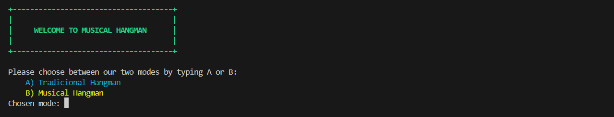
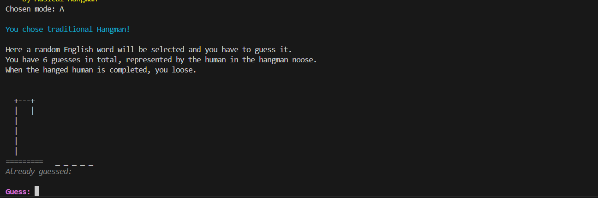
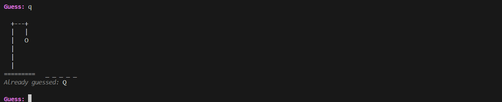
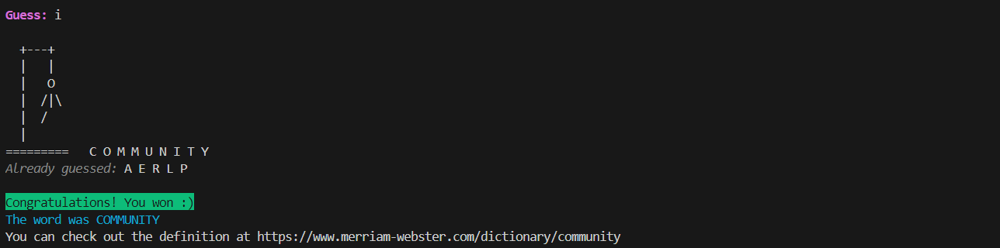
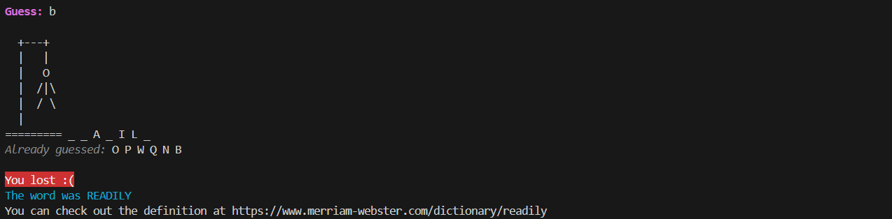
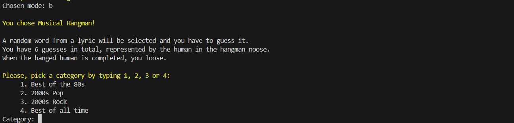
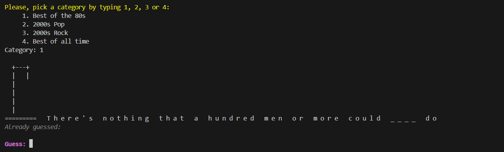
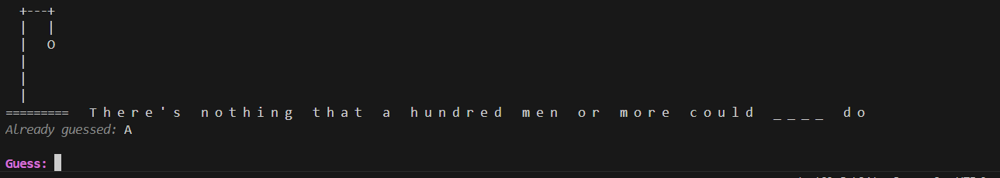
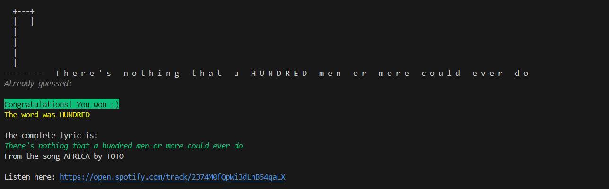
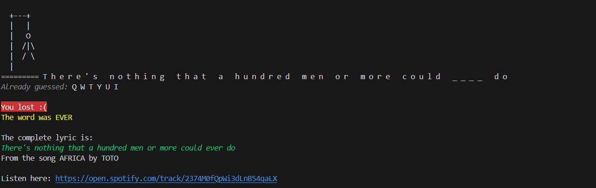

<a id="readme-top"></a>

# Musical Hangman

A word game where you can use your music knowledge and your hangman abilities.

<a href="https://youtu.be/-TD5Anpxoz0">View Demo</a>

<!-- TABLE OF CONTENTS -->
<details>
  <summary>Table of Contents</summary>
  <ol>
    <li>
      <a href="#about-the-project">Description</a>
      <ul>
        <li><a href="#built-with">Built With</a></li>
      </ul>
    </li>
    <li>
      <a href="#getting-started">Getting Started</a>
      <ul>
        <li><a href="#prerequisites">Prerequisites</a></li>
        <li><a href="#installation">Installation</a></li>
      </ul>
    </li>
    <li><a href="#usage">Usage</a></li>
    <li><a href="#contributing">Contributing</a></li>
    <li><a href="#license">License</a></li>
    <li><a href="#contact">Contact</a></li>
    <li><a href="#acknowledgments">Acknowledgments</a></li>
  </ol>
</details>

## Description
Musical hangman is a command-line Python application that allows the user to play traditional and musical hangman from their terminal. The musical mode, specifically, selects a word from a lyric selected at random from a song belonging to the chosen category. The user has to guess, in typical hangman style, the word. The language for both modes is English.

<p align="right">(<a href="#readme-top">back to top</a>)</p>


## Built With
- Python
- requests package
- simple-colors package
- Lyrist API
- Spotify API

<p align="right">(<a href="#readme-top">back to top</a>)</p>


## Getting Started
To use the project locally:

### Prerequisites
Before you begin, ensure you have met the following requirements:

- Latest version of Python.
- Working Windows, Mac or Linux computer.
- Basic knowledge of use of the Unix terminal or Powershell interface.

### Installation

1. Clone the repo
```sh
git clone https://github.com/CarolinaCampi/musical_hangman.git
cd musical_hangman
```
2. Create and activate a virtual environment
- For Unix/macOS:
```bash
python3 -m venv venv
source venv/bin/activate
```
- For Windows:
```bash
python -m venv venv
venv\Scripts\activate
```
3. Install the required dependencies
```bash
pip install -r requirements.txt
```

<p align="right">(<a href="#readme-top">back to top</a>)</p>


## Usage

After installing the necessary files and dependencies, use the program as follows:
1. Run the Python file from the command line from within the folder where the file is:
- For Unix/macOS:
```bash
python musical_hangman.py
```
- For Windows:
```bash
python .\musical_hangman.py
```
<figure>
    
    <figcaption>Initial menu to choose the play mode.</figcaption>
</figure>

2. Choose a mode by writing A (or a) or B (or b)

#### Traditional Hangman
3. If you choose option A: Traditional Hangman, the instructions will be displayed, as well as the initial gallows and word scheme to be guessed.

<figure>
    
    <figcaption>Traditional hangman instructions, initial gallows and word scheme for the word the user has to guess.</figcaption>
</figure>

4. You should type a single letter and see as the gallows, word scheme and Already guessed letters are updated. The next guess is asked for as well.

<figure>
    
    <figcaption>Updated gallows, word scheme and Already guessed list after the user guessed.</figcaption>
</figure>

5. You should then continue guessing until the complete word is guessed or you run out of incorrect guesses (Max 6 incorrect guesses).

- If you win:
<figure>
    
    <figcaption>You win!</figcaption>
</figure>

- If you lose:
<figure>
    
    <figcaption>You lost.</figcaption>
</figure>

#### Musical Hangman
3. If you choose option B: Musical Hangman, the instructions will be displayed, as well as the menu to pick a category.

<figure>
    
    <figcaption>Musicical hangman categories for the user to choose from.</figcaption>
</figure>

4. Choose a musical category from which the song and respective lyric will be selected at random. The initial gallows and word scheme to be guessed will be displayed along with the rest of the lyric, to give you more context for the guesses.

<figure>
    
    <figcaption>Gallows and lyric with missing word ready for the user to make the first guess.</figcaption>
</figure>

5. You should type a single letter and see as the gallows, word scheme and Already guessed letters are updated. The next guess is asked for as well. 

<figure>
    
    <figcaption>Updated gallows, word scheme and Already guessed list after the user guessed.</figcaption>
</figure>

6. Than continue guessing until the complete word is guessed or you run out of incorrect guesses (Max 6 incorrect guesses).

- If you win:
<figure>
    
    <figcaption>You win! The Spotify URL is provided if you want to listen to the song.</figcaption>
</figure>

- If you lose:
<figure>
    
    <figcaption>You lost :( The Spotify URL is provided if you want to listen to the song.</figcaption>
</figure>

<p align="right">(<a href="#readme-top">back to top</a>)</p>


## Contributing
Contributions are what make the open source community such an amazing place to learn, inspire, and create. Any contributions you make are greatly appreciated.

If you have a suggestion that would make this better, please fork the repo and create a pull request. Don't forget to give the project a star! Thanks again!

1. Fork the Project
2. Create your Feature Branch (git checkout -b feature/AmazingFeature)
3. Commit your Changes (git commit -m 'Add some AmazingFeature')
4. Push to the Branch (git push origin feature/AmazingFeature)
5. Open a Pull Request


## License
Distributed under the GNU GPL v3.0 license. See LICENSE for more information.

<p align="right">(<a href="#readme-top">back to top</a>)</p>


## Contact
Carolina Lucia Campi - carolinalcampi@gmail.com

Project Link: https://github.com/CarolinaCampi/musical_hangman

<p align="right">(<a href="#readme-top">back to top</a>)</p>


## Acknowledgments
- https://github.com/lyricstify/api
- https://developer.spotify.com/documentation/web-api
- https://pypi.org/project/simple-colors/
- https://pypi.org/project/pytest/
- https://github.com/othneildrew/Best-README-Template/blob/main/BLANK_README.md


<p align="right">(<a href="#readme-top">back to top</a>)</p>